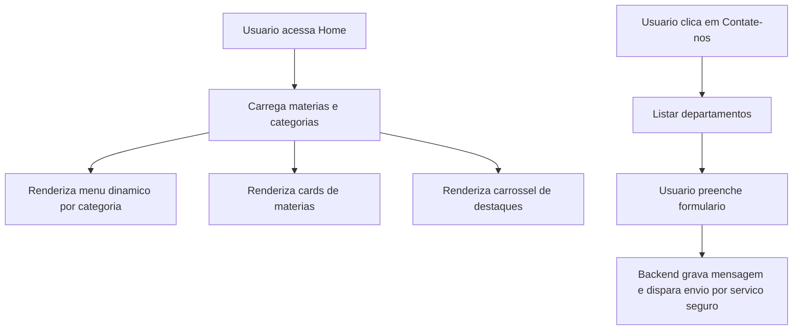
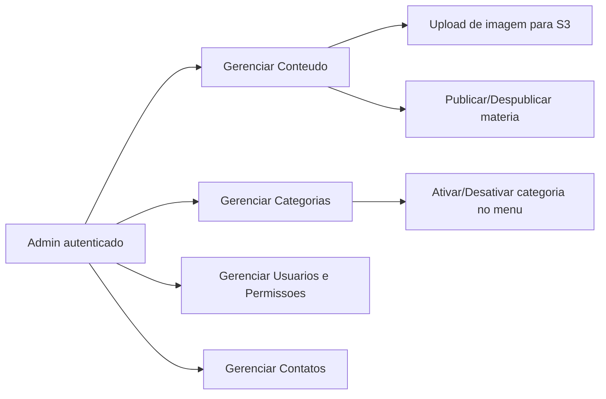

# 02 - Camada de Interface (Frontend)

## Objetivo

Descrever o comportamento esperado dos frontends (Portal do Usuario e Painel Administrativo), com foco em experiencia, seguranca e integracao com backend.

## Portal do Usuario (React)

### Funcionalidades principais

- Home em formato de cards
- Carrossel de destaques com `is_highlight = true`
- Menu dinamico renderizado por categorias ativas
- Area de autenticacao com login e cadastro
- Fluxo de contato sem exposicao de e-mail corporativo

### Fluxo funcional do portal

## Painel Administrativo (React Admin)

### Funcionalidades principais

- CRUD de materias
- Upload de imagens para S3
- Gestao de categorias e visibilidade no menu
- Gestao de usuarios e niveis de acesso
- Cadastro de departamentos de contato

### Fluxo simplificado do painel

## Requisitos de seguranca na camada de interface

- Frontend nunca acessa banco diretamente
- Todas as chamadas passam por API Gateway/WAF
- Dados sensiveis de destinatario de contato nao sao expostos ao cliente
