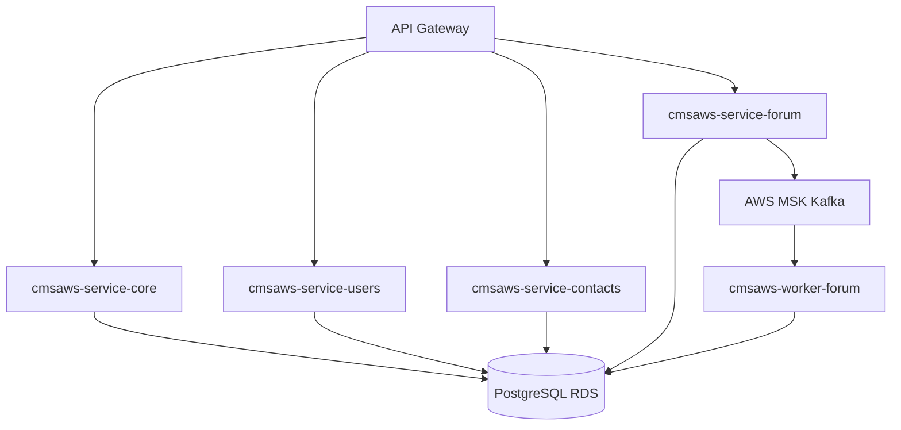

# 03 - Camada de Backend (Java 21)

## Objetivo

Documentar os microsservicos da camada core e suas responsabilidades de negocio.

## Stack

- Java 21
- Spring Boot 3.x
- Spring Data JPA
- Flyway para migrations
- Execucao em AWS Fargate

## Microsservicos

1. `cmsaws-service-core`: ciclo de vida de materias e categorias
2. `cmsaws-service-users`: cadastro de usuarios e RBAC
3. `cmsaws-service-contacts`: departamentos e mensagens de contato
4. `cmsaws-service-forum`: topicos e posts de forum
5. `cmsaws-worker-forum`: consumidor Kafka para processamento assincrono de interacoes

## Relacionamento entre servicos

## Versionamento de dados com Flyway

Cada microsservico possui migrations em `src/main/resources/db/migration`.

### Beneficios

- Evolucao de schema alinhada ao ciclo de release
- Aplicacao automatica e atomica na inicializacao
- Rastreabilidade de alteracoes de banco por servico

## Diretriz de performance

Operacoes de alta concorrencia devem priorizar processamento assincrono com Kafka para evitar bloqueio de resposta ao cliente.
