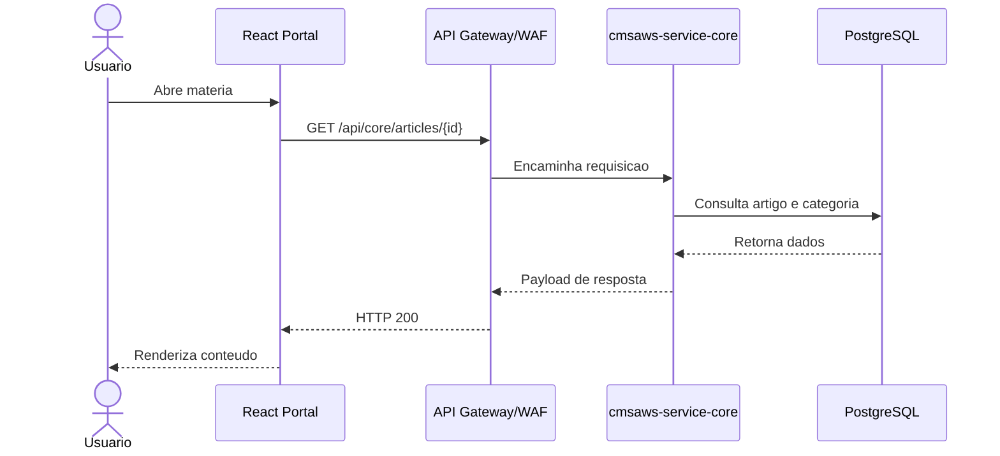
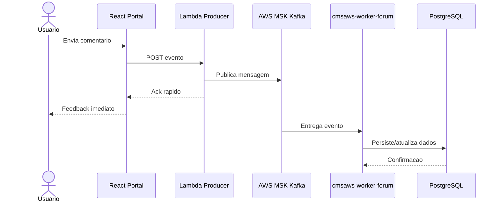

# 04 - Fluxos Sincronos e Assincronos

## Objetivo

Mapear os fluxos de operacao por tipo de processamento e justificar a escolha arquitetural.

## Matriz de operacoes

| Operacao | Tipo | Caminho da Requisicao | Motivacao |
|---|---|---|---|
| Login | Sincrono | React -> Lambda -> Redis | Velocidade instantanea e baixo custo |
| Leitura de materia | Sincrono | React -> API Gateway -> Fargate | Visualizacao imediata |
| Cadastro de usuario | Assincrono | React -> Lambda -> Kafka -> Worker | Resistir a picos e reduzir perda |
| Avaliacao (estrelas) | Assincrono | React -> Lambda -> Kafka -> Worker | Nao bloquear experiencia do usuario |
| Comentario forum | Assincrono | React -> Lambda -> Kafka -> Worker | Permite moderacao/processamento separado |
| Formulario contato | Assincrono | React -> Fargate -> Kafka -> SES | Entrega confiavel e trilha de auditoria |

## Sequencia - fluxo sincrono (leitura de materia)

## Sequencia - fluxo assincrono (comentario/forum)

## Criterio de decisao

- Sincrono: quando o valor de negocio depende da resposta em tempo real
- Assincrono: quando ha beneficio em desacoplar, absorver pico e reduzir latencia percebida
