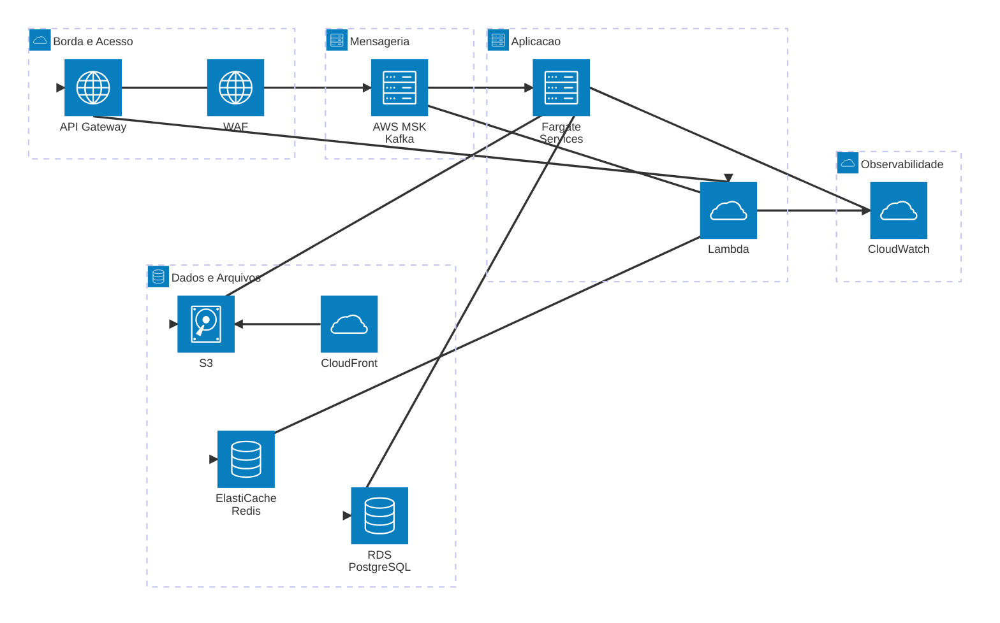

# 05 - Infraestrutura AWS e Seguranca

## Objetivo

Descrever os blocos de infraestrutura na AWS e os principais controles de seguranca e observabilidade.

## Componentes de infraestrutura

- API Gateway + WAF: protecao de borda
- AWS Lambda: workloads de entrada rapida
- AWS Fargate: execucao dos microsservicos Java
- AWS MSK (Kafka): mensageria assincrona
- Amazon RDS PostgreSQL: persistencia relacional
- ElastiCache Redis: cache e sessao
- S3 + CloudFront: armazenamento e distribuicao de imagens
- CloudWatch: logs, metricas e alarmes

## Topologia de referencia

## Controles de seguranca

- Nenhum frontend com acesso direto ao banco
- Endpoints protegidos na borda com WAF
- Segredos fora do codigo (Secrets Manager/Parameter Store)
- IAM Roles para acesso de servicos AWS sem chave fixa

## Escalabilidade e resiliencia

- Auto Scaling de tasks no Fargate por CPU/memoria
- Buffer de eventos no Kafka para absorver picos
- Redis para reduzir latencia em leituras frequentes
