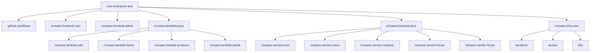

# 06 - Estrutura de Pastas do Monorepo

## Objetivo

Representar a organizacao do repositorio e a finalidade de cada macro-pasta.

## Estrutura revisada

## Convencoes

- Cada microsservico Java possui migrations Flyway proprias
- Lambdas sao organizadas por responsabilidade funcional
- Infraestrutura como codigo centralizada em `cmsaws-infra-aws`
- CI/CD centralizado em `.github/workflows`

## Proximas evolucoes de documentacao

- ADRs por decisao arquitetural
- Contratos de API por microsservico (OpenAPI)
- Runbooks de incidentes e operacao
- Diagramas de deploy por ambiente (dev/hml/prd)
