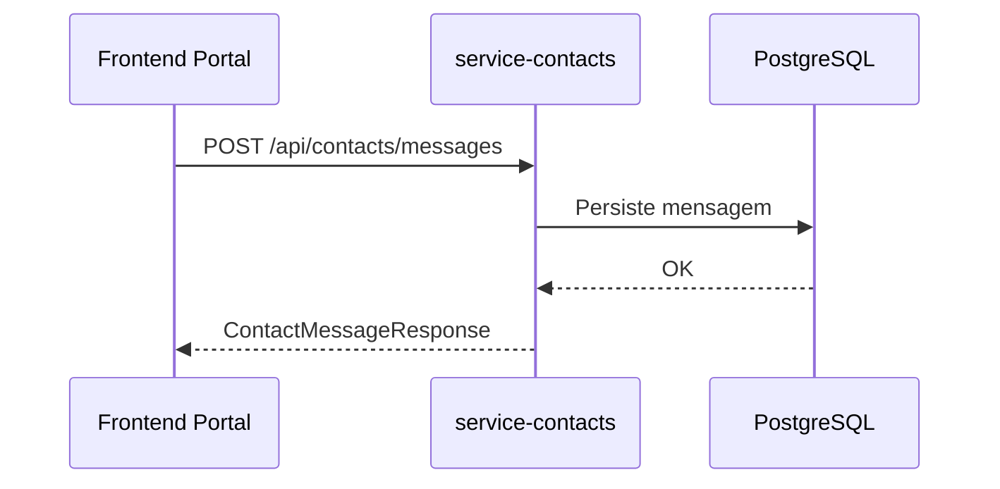

# cmsaws-service-contacts

## Responsabilidade

Gerenciar departamentos e mensagens do formulario de contato.

## Endpoints

- `GET /api/contacts/departments`
- `POST /api/contacts/departments`
- `GET /api/contacts/messages`
- `POST /api/contacts/messages`

## Contratos

### CreateDepartmentRequest

```json
{
  "name": "Suporte"
}
```

### DepartmentResponse

```json
{
  "id": "e2d976b7-a406-4f5a-bac5-e227fc3376d3",
  "name": "Suporte"
}
```

### CreateContactMessageRequest

```json
{
  "departmentId": "e2d976b7-a406-4f5a-bac5-e227fc3376d3",
  "name": "Ana",
  "email": "ana@example.com",
  "message": "Preciso de informacoes"
}
```

### ContactMessageResponse

```json
{
  "id": "130ac22f-0a1c-4967-9cb8-38f09ffca3c0",
  "departmentId": "e2d976b7-a406-4f5a-bac5-e227fc3376d3",
  "departmentName": "Suporte",
  "name": "Ana",
  "email": "ana@example.com",
  "message": "Preciso de informacoes"
}
```

## Fluxo


