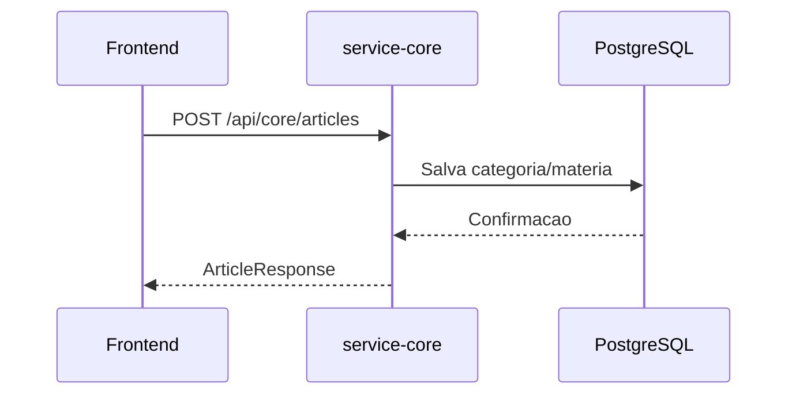

# cmsaws-service-core

## Responsabilidade

Gerenciar categorias e materias do portal.

## Endpoints

- `GET /api/core/categories`
- `POST /api/core/categories`
- `GET /api/core/articles`
- `POST /api/core/articles`

## Contratos

### CreateCategoryRequest

```json
{
  "name": "Tecnologia"
}
```

### CategoryResponse

```json
{
  "id": "3d9446b2-9312-4ea5-bf08-f0ea17942d47",
  "name": "Tecnologia"
}
```

### CreateArticleRequest

```json
{
  "title": "Nova versao",
  "content": "Conteudo da materia...",
  "categoryId": "3d9446b2-9312-4ea5-bf08-f0ea17942d47"
}
```

### ArticleResponse

```json
{
  "id": "9072d758-68cc-48f2-b6dc-ef70b440fdd4",
  "title": "Nova versao",
  "content": "Conteudo da materia...",
  "categoryId": "3d9446b2-9312-4ea5-bf08-f0ea17942d47",
  "categoryName": "Tecnologia"
}
```

## Erro de validacao (padrao)

```json
{
  "status": 400,
  "error": "Bad Request",
  "message": "Validation failed for one or more fields",
  "timestamp": "2026-04-18T21:00:00Z",
  "path": "/api/core/articles",
  "details": [
    "title: must not be blank",
    "content: must not be blank",
    "categoryId: must not be null"
  ]
}
```

## Fluxo


