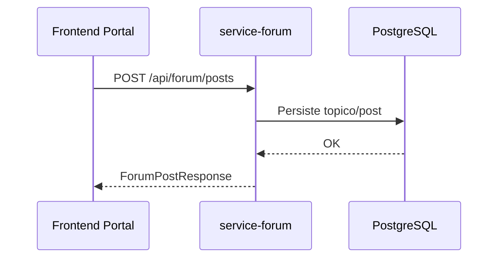

# cmsaws-service-forum

## Responsabilidade

Gerenciar topicos e posts de forum.

## Endpoints

- `GET /api/forum/topics`
- `POST /api/forum/topics`
- `GET /api/forum/posts`
- `POST /api/forum/posts`

## Contratos

### CreateForumTopicRequest

```json
{
  "title": "Arquitetura AWS"
}
```

### ForumTopicResponse

```json
{
  "id": "1a3a3003-7e12-426f-8824-a336fec94f72",
  "title": "Arquitetura AWS"
}
```

### CreateForumPostRequest

```json
{
  "topicId": "1a3a3003-7e12-426f-8824-a336fec94f72",
  "authorName": "Lia",
  "content": "Concordo com o uso de eventos assincronos."
}
```

### ForumPostResponse

```json
{
  "id": "56bd8e27-17c0-4d43-99af-fd0994087992",
  "topicId": "1a3a3003-7e12-426f-8824-a336fec94f72",
  "topicTitle": "Arquitetura AWS",
  "authorName": "Lia",
  "content": "Concordo com o uso de eventos assincronos."
}
```

## Fluxo


