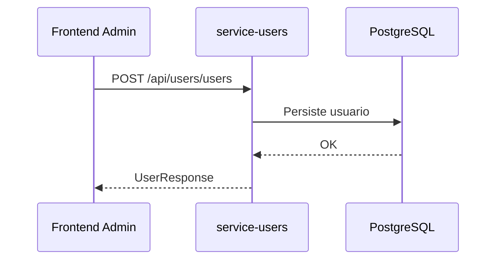

# cmsaws-service-users

## Responsabilidade

Gerenciar usuarios e permissoes basicas.

## Endpoints

- `GET /api/users/users`
- `POST /api/users/users`
- `DELETE /api/users/users/{id}`

## Contratos

### CreateUserRequest

```json
{
  "name": "Jorge",
  "email": "jorge@example.com",
  "roleId": "7cc6b12c-c8f5-46ba-95d0-ab9c8e6ef11a"
}
```

### UserResponse

```json
{
  "id": "e2ecc4c0-9d0f-42bb-a89f-2de870851da4",
  "name": "Jorge",
  "email": "jorge@example.com",
  "roleId": "7cc6b12c-c8f5-46ba-95d0-ab9c8e6ef11a",
  "roleName": "ADMIN",
  "statusDado": 1
}
```

## Erro de recurso nao encontrado

```json
{
  "status": 404,
  "error": "Not Found",
  "message": "User not found",
  "timestamp": "2026-04-18T21:00:00Z",
  "path": "/api/users/users/ea6b2b27-1ea8-4a84-9c28-5f07beac2c49",
  "details": []
}
```

## Fluxo


