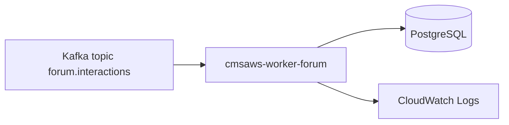

# cmsaws-worker-forum

## Responsabilidade

Consumir eventos assincronos do Kafka para processamento de interacoes de forum (avaliacoes/comentarios), sem expor API HTTP.

## Entradas (eventos)

Topico Kafka: `forum.interactions`

Exemplo de payload:

```json
{
  "eventId": "4c54dd8d-2a31-4520-bfb8-1f3d4f0f0505",
  "eventType": "FORUM_COMMENT_CREATED",
  "occurredAt": "2026-04-18T21:00:00Z",
  "payload": {
    "topicId": "1a3a3003-7e12-426f-8824-a336fec94f72",
    "authorName": "Lia",
    "content": "Mensagem do usuario"
  }
}
```

## Saidas

- Persistencia/atualizacao no PostgreSQL
- Logs estruturados no CloudWatch

## Fluxo



## Cobertura minima

- Smoke test de inicializacao do contexto Spring
