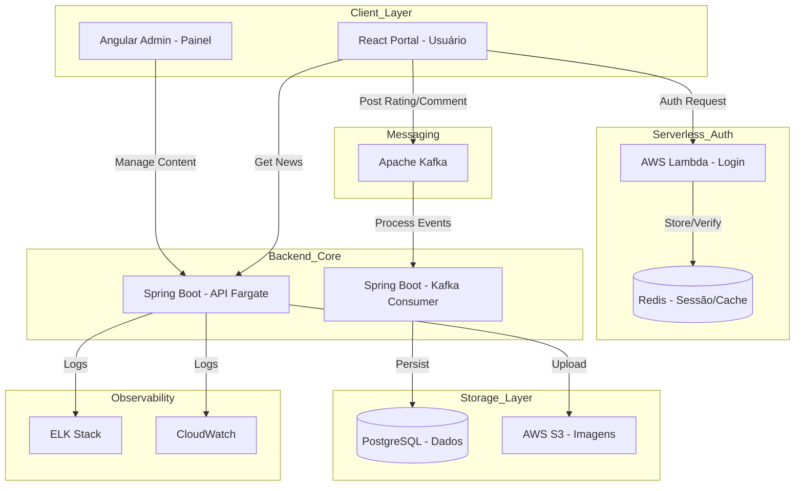

NewsFlow Tech Ecosystem - Documentação Técnica
Este repositório contém a solução completa do NewsFlow, um CMS (Content Management System) escalável, desenhado sob os princípios de arquitetura orientada a eventos, segregação de responsabilidades e infraestrutura como código.

# 🏗️ Visão Geral da Arquitetura
O ecossistema utiliza front-ends distintos para usuários e administradores, um backend em Java 21 rodando no AWS Fargate e processamento assíncrono via Kafka para operações que não exigem resposta imediata.

Fluxo de Componentes

📂 Estrutura de Pastas do Repositório
A raiz do projeto é organizada para suportar múltiplos subprojetos (Monorepo):

```
/newsflow-ecosystem
├── /apps
│   ├── newsflow-user-portal-react   # App em React (Portal Público)
│   └── newsflow-admin-panel-angular # App em Angular (Dashboard Admin)
├── /services
│   ├── newsflow-api-core            # Backend Java 21 (Spring Boot)
│   ├── newsflow-worker-consumer     # Consumer Java 21 (Kafka)
│   └── newsflow-lambda-auth         # Node.js/Java para AWS Lambda Login
├── /infra
│   ├── /docker                      # Dockerfiles por serviço
│   │   ├── postgres-init.sql        # Scripts de inicialização do banco
│   │   └── elasticsearch-config/    # Configurações do Logstash/Kibana
│   ├── /k8s                         # Manifestos Kubernetes
│   │   ├── deployments/             # Deployments dos microserviços
│   │   ├── services/                # Services e Ingress
│   │   └── secrets/                 # ConfigMaps e Secrets
│   └── /scripts                     # Scripts de automação (sh/python)
├── docker-compose.yml               # Orquestração local para desenvolvimento
└── README.md                        # Este arquivo
```

# 🚀 Detalhamento dos Módulos
## 1. Front-end Usuário (React)
- Tecnologias: React 18+, Tailwind CSS, Axios.
- Funcionalidades:
  - UI Responsiva com cards de matérias.
  - Scroll horizontal de destaques (flag is_highlight).
  - Menu dinâmico baseado em categorias vindas do banco.
  - Seção "Contate-nos": Lista de departamentos via API; envio de mensagem via formulário (proteção de e-mail).
- Segurança: Sanitização de inputs para evitar XSS.

## 2. Front-end Administrativo (Angular)
- Tecnologias: Angular 17+, Material UI.
- Funcionalidades:
  - Gerenciamento de Matérias, Categorias e Usuários.
  - Upload de banners para o S3.
  - Moderação de comentários e visualização de mensagens do "Contate-nos".

## 3. Backend (Java 21 + Spring Boot)
- Tecnologias: Java 21 (LTS), Spring Boot 3.2+, JPA/Hibernate, Spring Security.
- Integrações:
  - PostgreSQL: Armazenamento relacional de todas as entidades.
  - AWS S3: Armazenamento de arquivos estáticos (imagens das matérias).
  - Kafka: Produtor de eventos para cadastro de usuário, avaliações e comentários.
- Logs: Appender Logstash para ELK e CloudWatch Logs.

## 4. Autenticação (AWS Lambda + Redis)
- Fluxo: O Lambda recebe as credenciais, valida no PostgreSQL ou IAM, e registra o token no Redis para sessões rápidas e distribuídas.

# 🔧 Configuração e Execução Local
## Passo 1: Infraestrutura de Apoio
Na raiz do projeto, suba as dependências (Postgres, Kafka, Redis, Elastic Stack):

```shell
docker-compose up -d
```

## Passo 2: Executando o Kubernetes (Local)
Certifique-se de que o Minikube ou Docker Desktop K8s está ativo. Aplique os manifestos:

```shell

Aplicar Configurações e Credenciais
kubectl apply -f infra/k8s/secrets/

Aplicar Deployments e Services
kubectl apply -f infra/k8s/deployments/
kubectl apply -f infra/k8s/services/
```

# 🔒 Segurança e Melhores Práticas
1. IAM Role: O Fargate utilizará uma Role do IAM para acessar o S3 e o CloudWatch, eliminando chaves de acesso no código.

2. Anti-Fraud (Email): O e-mail dos contatos nunca é trafegado para o frontend. O frontend envia o contact_id e o backend resolve o destinatário para o envio via SMTP/SES.

3. Performance:
  - Leitura de matérias: Cache via Redis.
  - Escrita pesada: Processamento assíncrono via Kafka para não travar a UI.
4. Observabilidade: - Painéis no Kibana para monitorar erros 500 e latência de API.

CloudWatch Alarms para monitorar o status do cluster Fargate.

# 📈 Roadmap Técnico
- [ ] Implementação do Schema SQL inicial.
- [ ] Configuração do Boilerplate Spring Boot com Java 21.
- [ ] Setup do Cluster Kafka local no Docker Compose.
- [ ] Desenvolvimento da lógica de "Highlight" no React.
